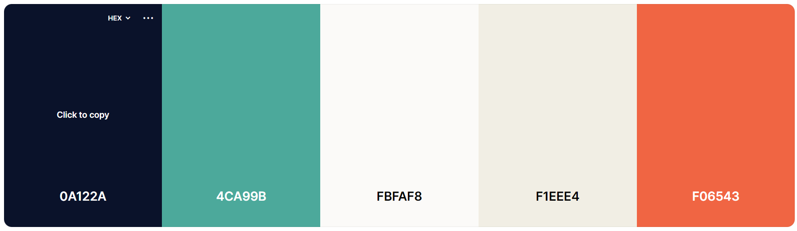

# Página Web Personal - README

Este README proporciona una visión general de la página web personal creada como parte del ejercicio de la Unidad Didáctica 3. La página web ha sido diseñada con HTML y CSS, siguiendo las directrices del enunciado proporcionado.

## Descripción

La página web es un currículum personal en línea, diseñado para destacar las habilidades y experiencias de Andres Abarca, un aspirante a Front End Developer con experiencia en diseño gráfico y desarrollo Full-Stack. El diseño y los estilos se han implementado con cuidado para lograr una presentación atractiva y una experiencia de usuario agradable.

## Contenido y Estructura

La página consta de los siguientes elementos:

### Hero Section: 
Encabezado de la página que muestra el nombre de Andres Abarca y su título de "Front End Developer". El fondo de esta sección incluye una imagen decorativa.

### Aside (Barra Lateral): 
Barra lateral que contiene enlaces a los perfiles de Andrés en LinkedIn, GitHub y su dirección de correo electrónico. Los iconos de las redes sociales reaccionan al pasar el cursor sobre ellos.

### Sección Sobre Mí (About Me): 
Una sección que resume la formación y experiencia de Andrés. Se presentan detalles clave sobre sus años de estudio en diseño gráfico, su finalización de un BootCamp de desarrollo Full-Stack y su título en Gestión de Proyectos. También se destaca su familiaridad con las metodologías ágiles. Un párrafo personal resalta su aspiración de trabajar en equipo y hacer realidad ideas extraordinarias.

### Sección Intereses y Estudios (Interests & Studies): 
Dos secciones: Intereses muestra una lista de intereses de Andrés, como Tecnología, Innovación y Diseño Web. Estudios presenta una tabla con años y descripciones de sus estudios pasados, incluidos los años de estudio en Diseño Gráfico, su título en Gestión de Proyectos y su finalización de un BootCamp de Desarrollo Full-Stack.

### Pie de Página (Footer): 
Muestra el año actual y los créditos del diseño de la página.

## Estilos y Diseño
### Colores: 
Se ha utilizado una paleta de colores que incluye tonos como Tomato para elementos decorativos, Alabaster para fondos y Lapis Lazulli para títulos destacados. El texto oscuro se presenta en Oxford Blue, mientras que el texto claro utiliza Seasalt.

### Fuentes: 
Las fuentes utilizadas son 'Kanit' para el contenido general y 'Nunito' para títulos específicos.

### Diseño Responsivo:
Los estilos CSS incluyen ajustes para pantallas de escritorio y dispositivos móviles (mediante media queries).

## Contribución
Este proyecto es parte de un ejercicio educativo y no se espera contribuciones externas. 
El código HTML y CSS proporcionado es una representación de las habilidades y estilo del creador.

## Créditos
**Diseño y Desarrollo:** Andres Abarca

**Recursos Gráficos:** Imágenes y SVGs incluidos en la carpeta assets/

**Fuentes:** 'Kanit' y 'Nunito' de Google Fonts

**Iconos:** Font Awesome

## Licencia
Este proyecto se proporciona solo con fines educativos y no tiene una licencia específica.
